# Laboratório dia 2 - Imersion Day AWS 2025
Passo a Passo do Laboratório realizado durante o AWS Immersion Day (Dia 2), com foco na implementação do AWS Cloudformation na configuracao de VPC e instancias EC2. serão dois laboratórios que se complementarão.

## AWS CloudFormation – Dia de Imersão Geral
<p align="center">
  
</p>

# Workshop de Introdução ao CloudFormation
## O que é CloudFormation Definição:
O AWS CloudFormation é um serviço que ajuda você a modelar e configurar seus recursos da AWS para que você possa dedicar menos tempo ao gerenciamento desses recursos e mais tempo aos seus aplicativos executados na AWS. Você cria um modelo que descreve todos os recursos da AWS desejados (como instâncias do Amazon EC2 ou instâncias de banco de dados do Amazon RDS), e o CloudFormation se encarrega de provisionar e configurar esses recursos para você.

O AWS CloudFormation pode ajudar em:

- Simplifique o gerenciamento de infraestrutura
- Replique rapidamente sua infraestrutura
- Controle e acompanhe facilmente as mudanças em sua infraestrutura

##Custos do Workshop
Não há custo adicional para usar o AWS CloudFormation com provedores de recursos nos seguintes namespaces: AWS::, Alexa:: e Custom::. Nesses casos, você paga pelos recursos da AWS, como instâncias do Amazon Elastic Compute Cloud (EC2), balanceadores de carga do Elastic Load Balancing etc., criados usando o AWS CloudFormation, da mesma forma que pagaria se os tivesse criado manualmente. Você paga apenas pelo que usar, sem taxas mínimas nem compromissos iniciais obrigatórios.

> 💰 **Nota sobre os custos**

| Categoria           | Preço por hora      |
|---------------------|---------------------|
| Amazon EC2 - t2.micro | US$ 0,0116          |

**Custo total do workshop:** entre **US$ 0,50 e US$ 1,00**, dependendo do tempo de uso e configuração.

💲 [Calculadora de preços AWS](https://calculator.aws/#/)

ℹ️ Esses valores são baseados na região **US East (N. Virginia)** e podem variar conforme a região e os recursos utilizados.

## Introdução
Este é um workshop de introdução ao AWS CloudFormation para familiarizar-se com o serviço.
Abordaremos o básico sobre como implementar o CloudFormation Service e criar um modelo juntos.

> ⚠️ **Por favor, leia antes de começar:**  
>  
> Este workshop é composto por **2 laboratórios interligados**, que devem ser realizados na ordem recomendada:  
>  
> 1. **Laboratório 1:** Configuração da **VPC** — responsável pela parte de rede onde a instância EC2 será criada.  
> 2. **Laboratório 2:** Configuração da **instância EC2** — responsável pela criação e configuração da instância que hospedará o site.  
>
> 📌 Seguir a sequência garante o correto funcionamento dos recursos.
>
>>> 
> 
> ⚠️ **Região padrão usada neste workshop:**  
>  
> `us-east-1` (EUA Leste - Norte da Virgínia)  
>  
> ⚙️ O modelo pode ser ajustado para outras regiões da AWS, mas isso exigirá que você altere também o **ID da AMI** correspondente.  
>  
> 📌 Recomendamos utilizar a região **us-east-1** até que você esteja familiarizado com as dependências do modelo para evitar problemas.

##Pré-requisitos
Para concluir este workshop, você precisará de:

1. Conhecimento básico dos serviços da AWS.
- VPC (Nuvem Privada Virtual).
- Grupo de Segurança
- EC2 (Nuvem de computação elástica).
- Dados do usuário
2. Conta AWS.
3. Conhecimento básico de YAML.
4. Editor de texto.
Você pode usar qualquer editor de código ou IDE de sua escolha que suporte edição YAML, mas para este workshop assumiremos o uso do Visual Studio Code pois funciona bem em macOS, Linux e Windows.

Você também pode baixar o [Visual Studio Code aqui](https://code.visualstudio.com/download)

# Laboratório 1 - Configurando uma VPC

## Visão geral
Este laboratório começará com o modelo mais básico imitando o VPC Hands-on Lab para o AWS General Immersion Day.

Ao final deste laboratório, você será capaz de:

Escreva um modelo básico do CloudFormation que crie uma VPC, sub-redes, tabela de roteamento e grupo de segurança.
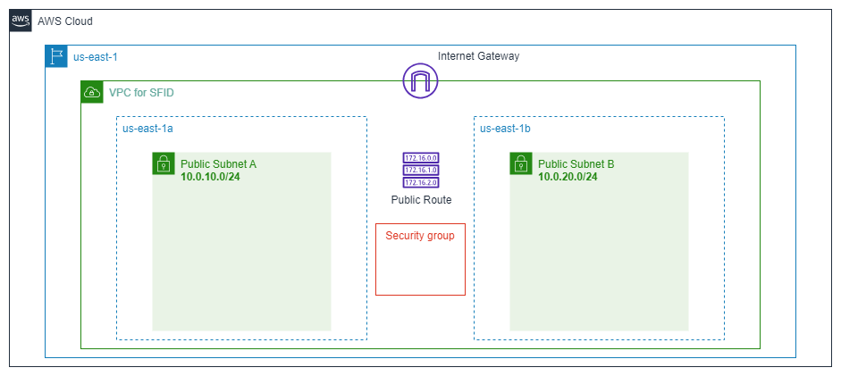

##Criar uma VPC
Nosso primeiro passo é criar uma VPC simples usando CloudFormation
l. Abra um editor de texto e crie um arquivo YAML vazio chamado:

```yaml
sfid-cfn-vpc.yaml
```
2. Copie e cole o modelo de exemplo do CloudFormation abaixo que define uma VPC e salve o arquivo.
```yaml
Resources:
  # Create a VPC
  MainVPC:
    Type: AWS::EC2::VPC
    Properties:
      CidrBlock: 10.0.0.0/16
```

3. Abra o console do AWS CloudFormation
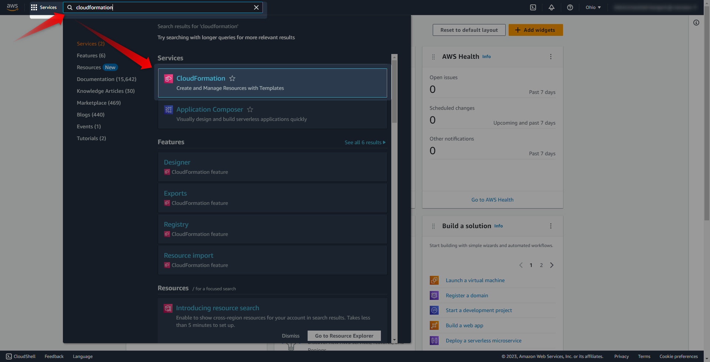

4. Clique em **Criar pilha**.
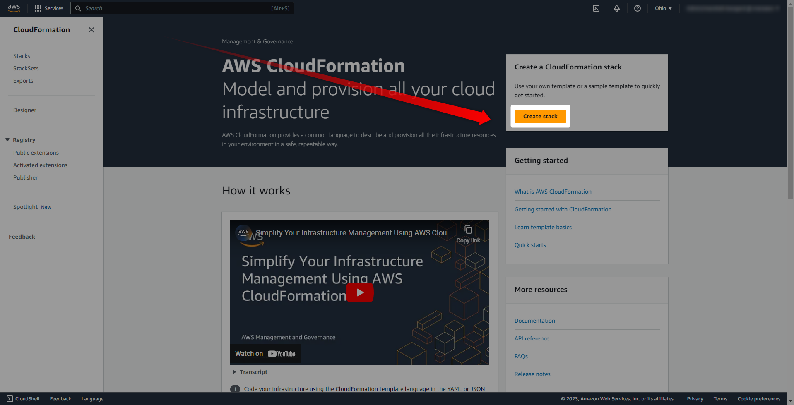

5. Em Preparar modelo, escolha **Modelo pronto**.

6. Em Origem do modelo, escolha **Carregar um arquivo de modelo**.

7. Clique no botão **Escolher arquivo** e navegue até onde o sfid-cfn-vpc.yaml foi salvo.

8. Selecione o arquivo sfid-cfn-vpc.yaml e clique em **Abrir**.

9. Clique em **Avançar**.
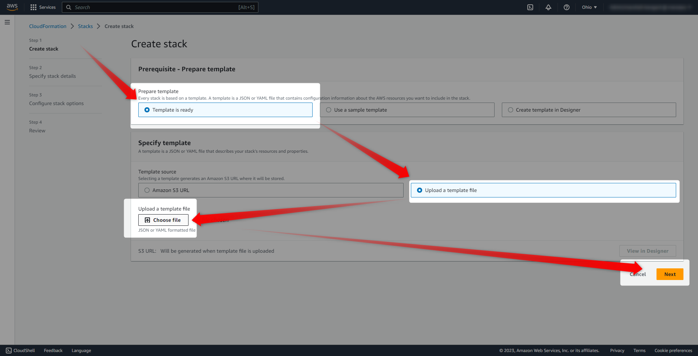

10. Forneça um nome para a pilha e clique em Avançar .
- O nome da pilha identifica a pilha. Use um nome para ajudar a distinguir a finalidade desta pilha.
- Recomendamos o uso para o propósito do nosso laboratório:
 ```yaml
SFID-CFN-VPC
```
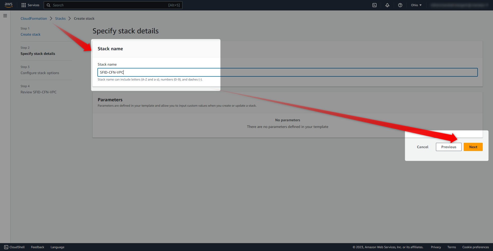

11. Você pode deixar Configurar opções de pilha como padrão e clicar em **Avançar**.
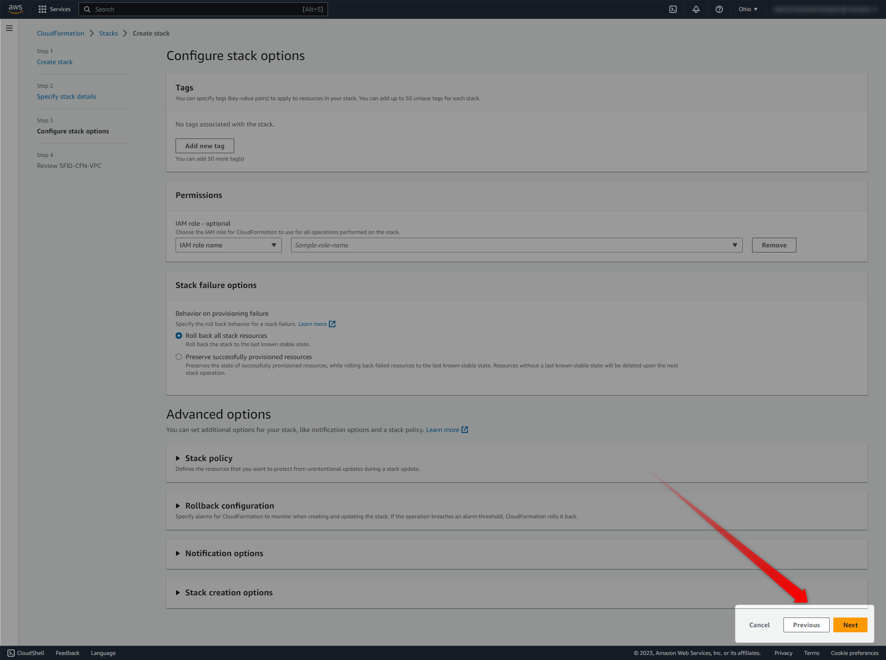

12. Na página Revisar SFID-CFN-VPC , role para baixo até o final e escolha **Enviar**.
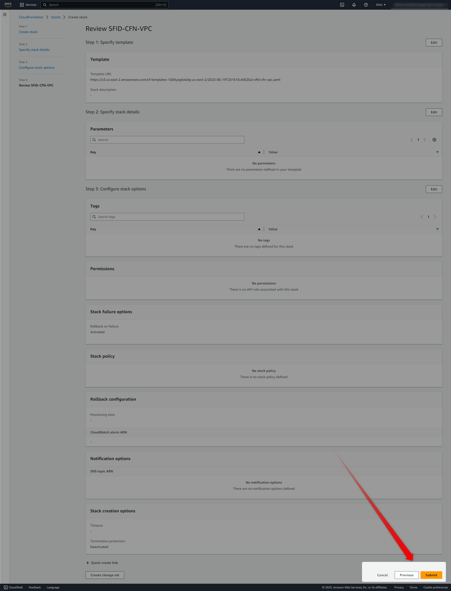

13. Você pode clicar no botão de atualização algumas vezes até ver o status **CREATE_COMPLETE**.
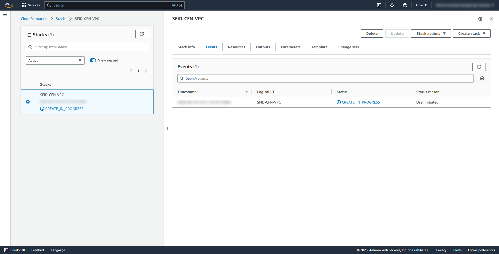
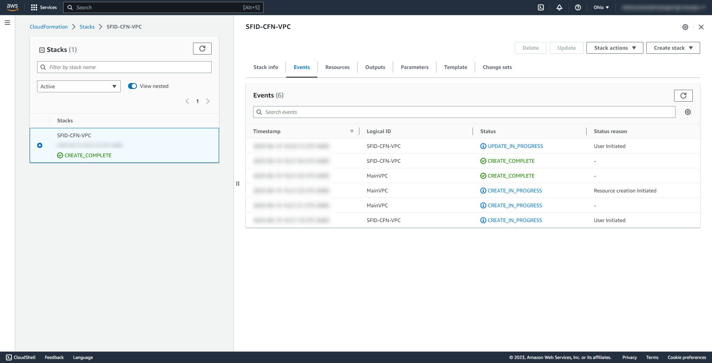

14. Abra o console do AWS VPC para verificar a VPC criada usando o AWS CloudFormation
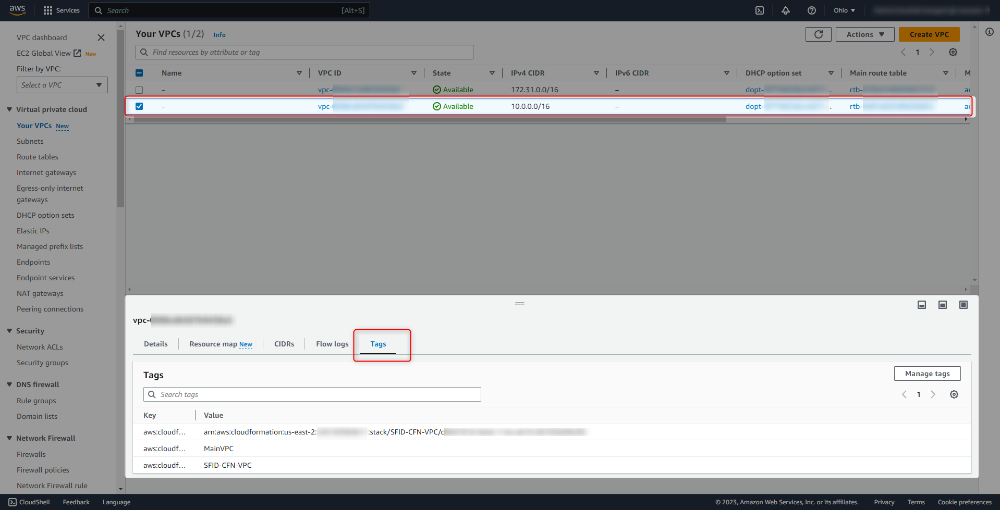

**Agora que criamos uma VPC simples, precisamos habilitar as opções de DNS e nomear a VPC “VPC para SFID CFN”.Agora que criamos uma VPC simples, precisamos habilitar as opções de DNS e nomear a VPC “VPC para SFID CFN”.**

15. Adicione o seguinte ao final do arquivo YAML chamado sfid-cfn-vpc.yaml e salve o arquivo.
```yaml
      EnableDnsHostnames: 'true'
      EnableDnsSupport: 'true'
      Tags:
      - Key: Name
        Value: VPC for SFID CFN
```

16. Abra o console do AWS CloudFormation 

17. Selecione o nome da pilha “SFID-CFN-VPC” na lista de pilhas.

18. Clique no botão **Atualizar**.
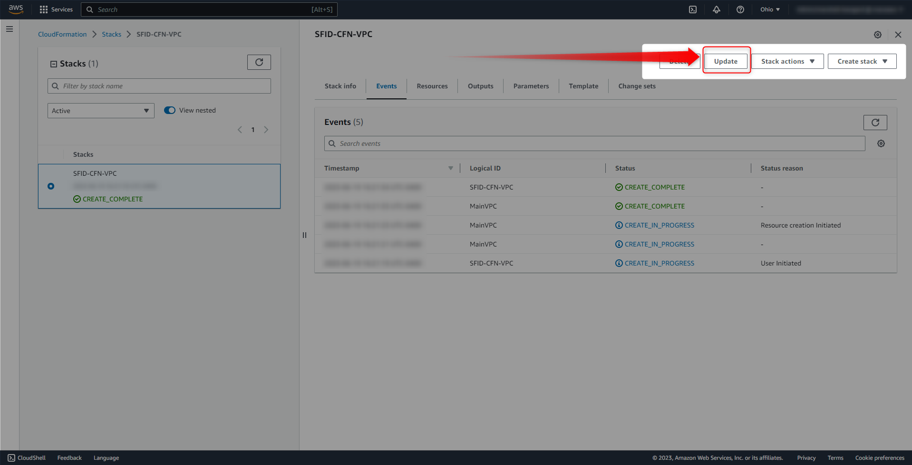

19. Em Preparar modelo, escolha **Substituir modelo atual**.
20. Em Origem do modelo, escolha **Carregar um arquivo de modelo**.
21. Clique no botão **Escolher arquivo** e navegue até onde o sfid-cfn-vpc.yaml foi salvo.
22. Selecione o arquivo sfid-cfn-vpc.yaml e clique em **Abrir**.
23. Clique em **Avançar**.
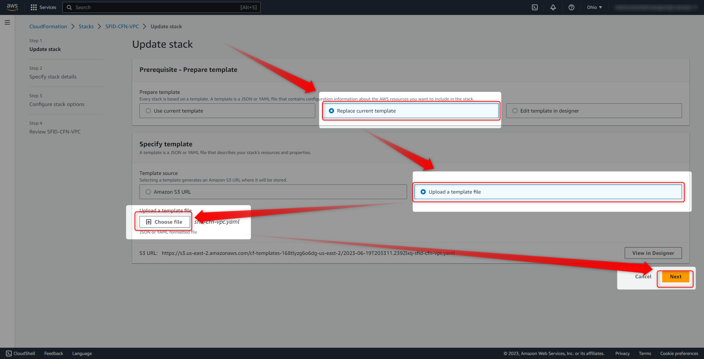

24. Você pode deixar os Parâmetros já que nada foi definido e clicar em **Avançar**.
25. Você pode deixar Configurar opções de pilha como padrão e clicar em **Avançar**.
26. Verifique a lista Alterações na visualização do conjunto de alterações; que mostra como as alterações podem afetar os recursos em execução; neste caso, elas não afetarão nosso modelo.
27. Clique em **Enviar**.
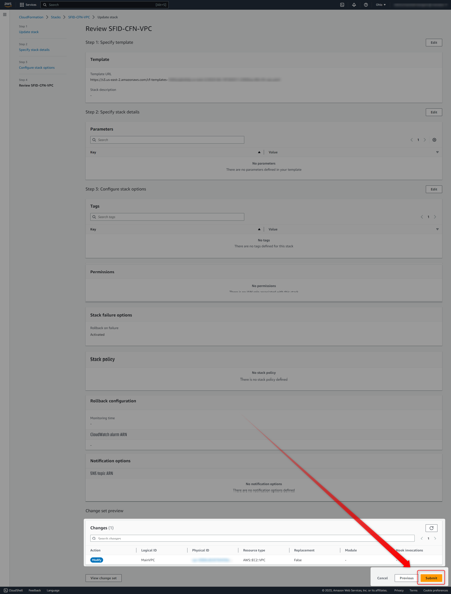

28. Você pode clicar no botão de atualização algumas vezes até ver o status **UPDATE_COMPLETE**.
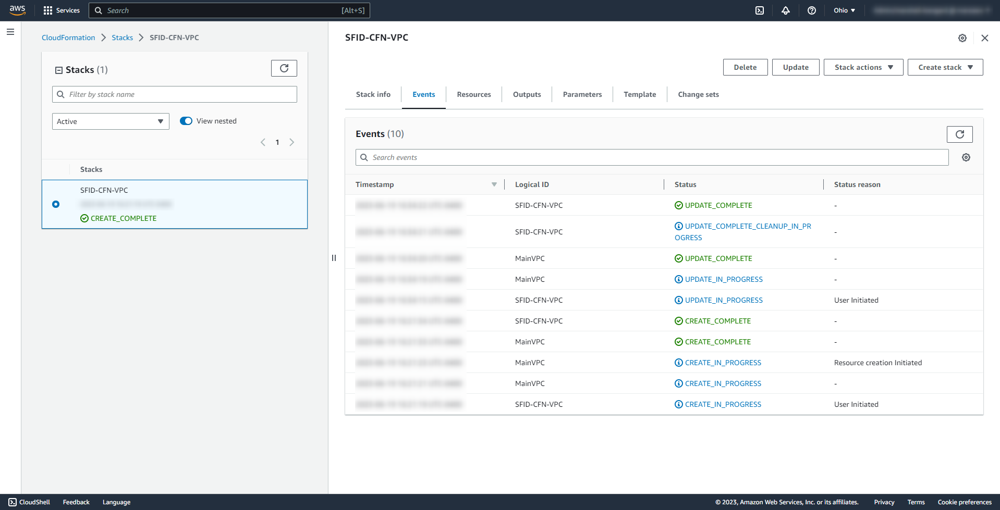
Navegue até o console do AWS VPC para verificar as opções de VPC Tag e DNS habilitadas usando o AWS CloudFormation.
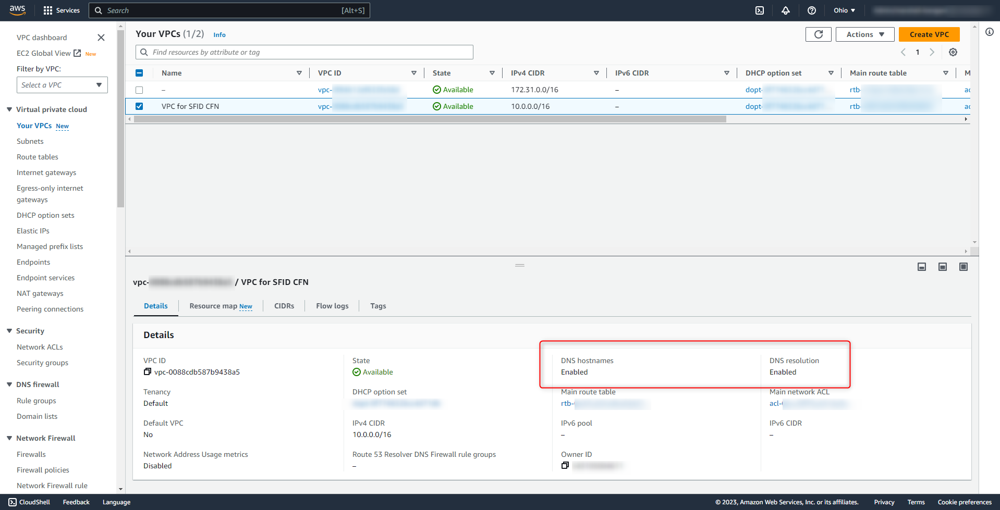

**Esta é a arquitetura atual até agora.**
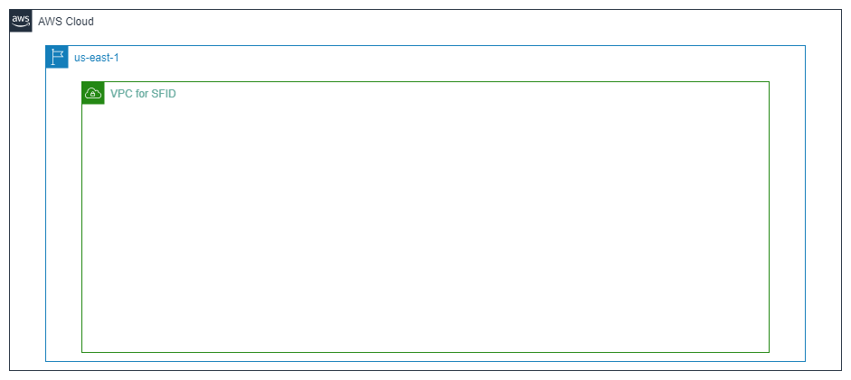

## Criar Gateway de Internet
Nossa segunda etapa do Laboratório 1 é criar e anexar um Gateway de Internet

1. Adicione o seguinte ao final do arquivo YAML chamado sfid-cfn-vpc.yaml e salve o arquivo.
```yaml
  # Create and attach InternetGateway
  InternetGateway:
    Type: AWS::EC2::InternetGateway
    DependsOn: MainVPC

  AttachIGW:
    Type: AWS::EC2::VPCGatewayAttachment
    Properties:
      VpcId: !Ref MainVPC
      InternetGatewayId: !Ref InternetGateway
```

2. Abra o console do AWS CloudFormation Stacks 
3. Selecione o nome da pilha “SFID-CFN-VPC” na lista de pilhas
4. Clique no botão **Atualizar**.
5. Em Preparar modelo, escolha **Substituir modelo atual**.
6. Em Origem do modelo, escolha **Carregar um arquivo de modelo**.
7. Clique no botão **Escolher arquivo** e navegue até onde o sfid-cfn-vpc.yaml foi salvo
8. Selecione o arquivo sfid-cfn-vpc.yaml e clique em **Abrir**.
9. Clique em **Avançar**.
10. Você pode deixar os Parâmetros já que nada foi definido e clicar em **Avançar**.
11. Você pode deixar Configurar opções de pilha como padrão e clicar em **Avançar**.
12. Verifique a lista Alterações na visualização do conjunto de alterações; que mostra como as alterações podem afetar os recursos em execução; neste caso, elas não afetarão nosso modelo.
13. Clique em **Enviar**.
14. Você pode clicar no botão de atualização algumas vezes até ver o status **UPDATE_COMPLETE**.
Navegue até o console do AWS VPC para verificar o Gateway de Internet conectado à VPC.

**Esta é a arquitetura atual até agora.**
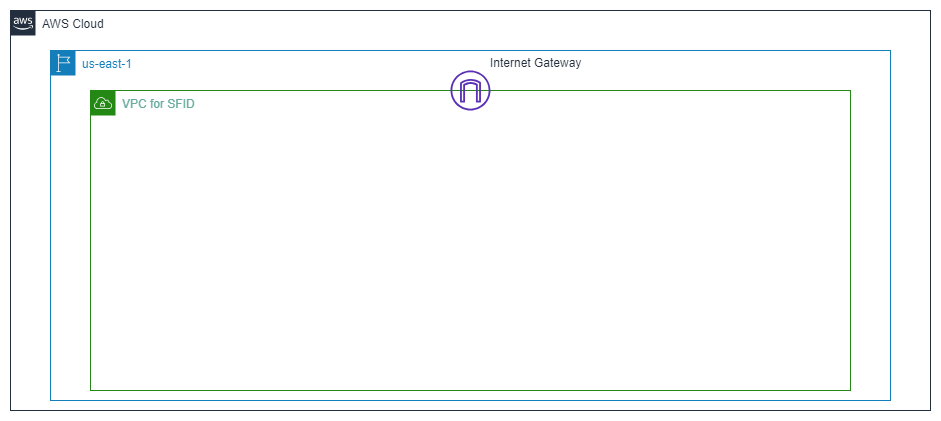

## Criar primeira sub-rede
Nosso terceiro passo do Laboratório 1 é criar nossa primeira sub-rede

1. Adicione o seguinte ao final do arquivo YAML chamado sfid-cfn-vpc.yaml e salve o arquivo.
```yaml
  # Create First Subnet
  FirstSubnet:
    Type: AWS::EC2::Subnet
    Properties:
      VpcId: !Ref MainVPC
      CidrBlock: 10.0.10.0/24
      AvailabilityZone: "us-east-1a"
      Tags:
      - Key: Name
        Value: Public Subnet A - SFID
```

2. Abra o console do AWS CloudFormation Stacks 
3. Selecione o nome da pilha “SFID-CFN-VPC” na lista de pilhas
4. Clique no botão **Atualizar**.
5. Em Preparar modelo, escolha **Substituir modelo atual**.
6. Em Origem do modelo, escolha **Carregar um arquivo de modelo**.
7. Clique no botão **Escolher arquivo** e navegue até onde o sfid-cfn-vpc.yaml foi salvo
8. Selecione o arquivo sfid-cfn-vpc.yaml e clique em **Abrir**.
9. Clique em **Avançar**.
10. Você pode deixar os Parâmetros já que nada foi definido e clicar em **Avançar**.
11. Você pode deixar Configurar opções de pilha como padrão e clicar em **Avançar**.
12. Verifique a lista Alterações na visualização do conjunto de alterações; que mostra como as alterações podem afetar os recursos em execução; neste caso, elas não afetarão nosso modelo.
13. Clique em **Enviar**.
14. Você pode clicar no botão de atualização algumas vezes até ver o status **UPDATE_COMPLETE**.
Navegue até o console do AWS VPC para verificar a primeira sub-rede.

**Esta é a arquitetura atual até agora.**
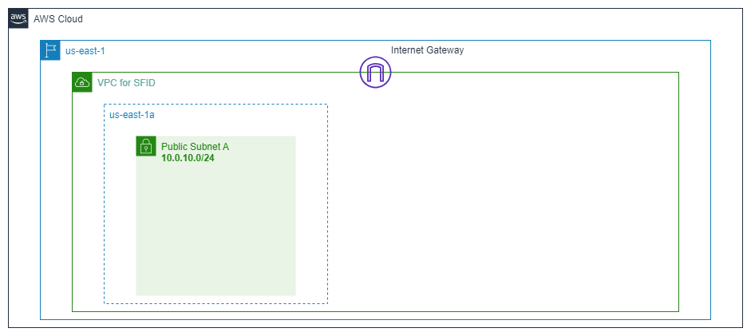

## Criar sub-rede adicional
Nossa quarta etapa do Laboratório 1 é criar uma sub-rede adicional

1. Adicione o seguinte ao final do arquivo YAML chamado sfid-cfn-vpc.yaml e salve o arquivo.
```yaml
  # Creating additional subnet
  SecondSubnet:
    Type: AWS::EC2::Subnet
    Properties:
      VpcId: !Ref MainVPC
      CidrBlock: 10.0.20.0/24
      AvailabilityZone: "us-east-1b"
      Tags:
      - Key: Name
        Value: Public Subnet B - SFID
```

2. Abra o console do AWS CloudFormation Stacks 
3. Selecione o nome da pilha “SFID-CFN-VPC” na lista de pilhas
4. Clique no botão Atualizar .
5. Em Preparar modelo, escolha Substituir modelo atual .
6. Em Origem do modelo, escolha Carregar um arquivo de modelo .
7. Clique no botão Escolher arquivo e navegue até onde o sfid-cfn-vpc.yaml foi salvo
8. Selecione o arquivo sfid-cfn-vpc.yaml e clique em Abrir .
9. Clique em Avançar .
10. Você pode deixar os Parâmetros já que nada foi definido e clicar em Avançar .
11. Você pode deixar Configurar opções de pilha como padrão e clicar em Avançar .
12. Verifique a lista Alterações na visualização do conjunto de alterações; que mostra como as alterações podem afetar os recursos em execução; neste caso, elas não afetarão nosso modelo.
13. Clique em Enviar .
14. Você pode clicar no botão de atualização algumas vezes até ver o status UPDATE_COMPLETE .
Navegue até o console do AWS VPC para verificar a sub-rede adicional.

**Esta é a arquitetura atual até agora.**
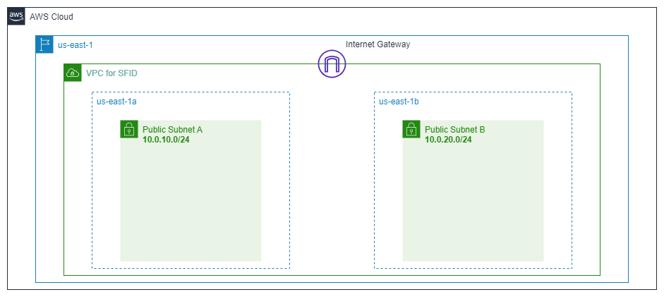

## Configurando a tabela de roteamento
Nosso quinto passo do Laboratório 1 é criar uma tabela de roteamento pública e associar as duas sub-redes.

1. Adicione o seguinte ao final do arquivo YAML chamado sfid-cfn-vpc.yaml e salve o arquivo.
```yaml
  # Create and Set Public Route Table
  PublicRouteTable:
    Type: AWS::EC2::RouteTable
    Properties:
      VpcId:  !Ref MainVPC
      Tags:
      - Key: Name
        Value: Public Route Table

  PublicRoute:
    Type: 'AWS::EC2::Route'
    DependsOn: AttachIGW
    Properties:
      RouteTableId: !Ref PublicRouteTable
      DestinationCidrBlock: 0.0.0.0/0
      GatewayId: !Ref InternetGateway

  # Associate Public Subnets to Public Route Table
  PublicSubnet1RouteTableAssociation:
    Type: 'AWS::EC2::SubnetRouteTableAssociation'
    Properties:
      SubnetId: !Ref FirstSubnet
      RouteTableId: !Ref PublicRouteTable

  PublicSubnet2RouteTableAssociation:
    Type: 'AWS::EC2::SubnetRouteTableAssociation'
    Properties:
      SubnetId: !Ref SecondSubnet
      RouteTableId: !Ref PublicRouteTable
```

2. Abra o console do AWS CloudFormation Stacks 
3. Selecione o nome da pilha “SFID-CFN-VPC” na lista de pilhas
4. Clique no botão **Atualizar**.
5. Em Preparar modelo, **escolha Substituir modelo atual**.
6. Em Origem do modelo, escolha **Carregar um arquivo de modelo**.
7. Clique no botão **Escolher arquivo** e navegue até onde o sfid-cfn-vpc.yaml foi salvo
8. Selecione o arquivo sfid-cfn-vpc.yaml e clique em **Abrir**.
9. Clique em **Avançar**.
10. Você pode deixar os Parâmetros já que nada foi definido e clicar em **Avançar**.
11. Você pode deixar Configurar opções de pilha como padrão e clicar em **Avançar**.
12. Verifique a lista Alterações na visualização do conjunto de alterações; que mostra como as alterações podem afetar os recursos em execução; neste caso, elas não afetarão nosso modelo.
13. Clique em **Enviar**.
14. Você pode clicar no botão de atualização algumas vezes até ver o status **UPDATE_COMPLETE**.
Navegue até o console do AWS VPC para verificar a tabela de roteamento público e associar as 2 sub-redes.

**Esta é a arquitetura atual até agora.**


## Criar grupo de segurança
Nossa sexta etapa do Laboratório 1 é criar um Grupo de Segurança

1. Adicione o seguinte ao final do arquivo YAML chamado sfid-cfn-vpc.yaml e substitua o endereço IP abaixo pelo seu endereço IP público. Depois, salve o arquivo.
```yaml
  # Create Security Group for the following:
  MainSecurityGroup:
    Type: AWS::EC2::SecurityGroup
    Properties:
      GroupDescription: Security Group for Web Server
      VpcId: !Ref MainVPC
      SecurityGroupIngress:
      - IpProtocol: tcp
        FromPort: 80
        ToPort: 80
  # Replace the IP address below by your Public IP Address:
        CidrIp: 127.0.0.1/32
      Tags:
      - Key: Name
        Value: Web Server Security Group - SFID
```

2. Abra o console do AWS CloudFormation Stacks 
3. Selecione o nome da pilha “SFID-CFN-VPC” na lista de pilhas
4. Clique no botão Atualizar .
5. Em Preparar modelo, escolha Substituir modelo atual .
6. Em Origem do modelo, escolha Carregar um arquivo de modelo .
7. Clique no botão Escolher arquivo e navegue até onde o sfid-cfn-vpc.yaml foi salvo
8. Selecione o arquivo sfid-cfn-vpc.yaml e clique em Abrir .
9. Clique em Avançar .
10. Você pode deixar os Parâmetros já que nada foi definido e clicar em Avançar .
11. Você pode deixar Configurar opções de pilha como padrão e clicar em Avançar .
12. Verifique a lista Alterações na visualização do conjunto de alterações; que mostra como as alterações podem afetar os recursos em execução; neste caso, elas não afetarão nosso modelo.
13. Clique em Enviar .
14. Você pode clicar no botão de atualização algumas vezes até ver o status UPDATE_COMPLETE .
Navegue até o console do AWS VPC para verificar o Grupo de Segurança.

**Esta é a arquitetura atual até agora.**


## Complementos
Nossa última etapa do Laboratório 1 é adicionar uma descrição ao modelo do CloudFormation e adicionar saídas.

1. Adicione o seguinte ao **topo** do arquivo YAML chamado sfid-cfn-vpc.yaml
```yaml
Description: Introduction to CloudFormation SFID - Virtual Private Cloud (VPC)
```
2. Adicione o seguinte ao final do arquivo YAML chamado sfid-cfn-vpc.yaml e salve o arquivo.
```yaml
Outputs:
  MainSubnet:
    Value: !Ref FirstSubnet
    Description: Public Subnet ID with Direct Internet Route

  MainSecurityGroup:
    Value: !Ref MainSecurityGroup
    Description: Security Group ID for the Web Server
```

3. Abra o console do AWS CloudFormation Stacks 
4. Selecione o nome da pilha “SFID-CFN-VPC” na lista de pilhas
5. Clique no botão **Atualizar**.
6. Em Preparar modelo, escolha **Substituir modelo atual**.
7. Em Origem do modelo, escolha **Carregar um arquivo de modelo**.
8. Clique no botão **Escolher arquivo** e navegue até onde o sfid-cfn-vpc.yaml foi salvo
9. Selecione o arquivo sfid-cfn-vpc.yaml e clique em **Abrir**.
10. Clique em **Avançar**.
11. Você pode deixar os Parâmetros já que nada foi definido e clicar em **Avançar**.
12. Você pode deixar Configurar opções de pilha como padrão e clicar em **Avançar**.
13. Verifique a lista Alterações na visualização do conjunto de alterações; que mostra como as alterações podem afetar os recursos em execução; neste caso, elas não afetarão nosso modelo.
14. Clique em **Enviar**.
15. Você pode clicar no botão de atualização algumas vezes até ver o status **UPDATE_COMPLETE**.
Navegue até as guias “Stack Info” e “Outputs” do SFID-CFN-VPC e observe as alterações feitas na pilha.

## Resumo do Laboratório 1
Dividimos nosso modelo CloudFormation no seguinte e fornecemos uma recapitulação do modelo CloudFormation:

- Criei uma VPC, marquei-a fornecendo um nome e configurei as opções de DNS
- Criei um Gateway de Internet e o conectei à VPC
- Criei duas sub-redes na VPC
- Criou uma tabela de rotas pública e associou as duas sub-redes
- Criei um Grupo de Segurança que permite acesso de entrada em HTTP para o Laboratório 2
- Adicionei uma Descrição e Saídas para melhor compreensão do modelo.

Agora que definimos a parte de rede para este laboratório, passaremos para o próximo laboratório para configurar uma instância EC2 e atuar como servidor web usando o CloudFormation.

```yaml
Description: Introduction to CloudFormation SFID - Virtual Private Cloud (VPC)
Resources:

  # Create a VPC
  MainVPC:
    Type: AWS::EC2::VPC
    Properties:
      CidrBlock: 10.0.0.0/16
      EnableDnsHostnames: 'true'
      EnableDnsSupport: 'true'
      Tags:
      - Key: Name
        Value: VPC for SFID CFN

# Create and attach InternetGateway
  InternetGateway:
    Type: AWS::EC2::InternetGateway
    DependsOn: MainVPC

  AttachIGW:
    Type: AWS::EC2::VPCGatewayAttachment
    Properties:
      VpcId: !Ref MainVPC
      InternetGatewayId: !Ref InternetGateway

# Create First Subnet
  FirstSubnet:
    Type: AWS::EC2::Subnet
    Properties:
      VpcId: !Ref MainVPC
      CidrBlock: 10.0.10.0/24
      AvailabilityZone: "us-east-1a"
      Tags:
      - Key: Name
        Value: Public Subnet A - SFID

# Creating additional subnet
  SecondSubnet:
    Type: AWS::EC2::Subnet
    Properties:
      VpcId: !Ref MainVPC
      CidrBlock: 10.0.20.0/24
      AvailabilityZone: "us-east-1b"
      Tags:
      - Key: Name
        Value: Public Subnet B - SFID

# Create and Set Public Route Table
  PublicRouteTable:
    Type: AWS::EC2::RouteTable
    Properties:
      VpcId:  !Ref MainVPC
      Tags:
      - Key: Name
        Value: Public Route Table

  PublicRoute:
    Type: 'AWS::EC2::Route'
    DependsOn: AttachIGW
    Properties:
      RouteTableId: !Ref PublicRouteTable
      DestinationCidrBlock: 0.0.0.0/0
      GatewayId: !Ref InternetGateway

  # Associate Public Subnets to Public Route Table
  PublicSubnet1RouteTableAssociation:
    Type: 'AWS::EC2::SubnetRouteTableAssociation'
    Properties:
      SubnetId: !Ref FirstSubnet
      RouteTableId: !Ref PublicRouteTable

  PublicSubnet2RouteTableAssociation:
    Type: 'AWS::EC2::SubnetRouteTableAssociation'
    Properties:
      SubnetId: !Ref SecondSubnet
      RouteTableId: !Ref PublicRouteTable
      
  # Create Security Group for the following:
  MainSecurityGroup:
    Type: AWS::EC2::SecurityGroup
    Properties:
      GroupDescription: Security Group for Web Server
      VpcId: !Ref MainVPC
      SecurityGroupIngress:
      - IpProtocol: tcp
        FromPort: 80
        ToPort: 80
  # Replace the IP address below by your Public IP Address:
        CidrIp: 127.0.0.1/32
      Tags:
      - Key: Name
        Value: Web Server Security Group - SFID

Outputs:
  MainSubnet:
    Value: !Ref FirstSubnet
    Description: Public Subnet ID with Direct Internet Route

  MainSecurityGroup:
    Value: !Ref MainSecurityGroup
    Description: Security Group ID for the Web Server
```


# Laboratório 2 - Configurando uma instância EC2
## Visão geral
Este laboratório começará com o modelo mais básico imitando o laboratório prático Compute – Amazon EC2 para o AWS General Immersion Day.

Ao final deste laboratório, você será capaz de:

Escreva um modelo básico do CloudFormation que crie uma instância EC2 Linux, que atuará como um servidor Web.
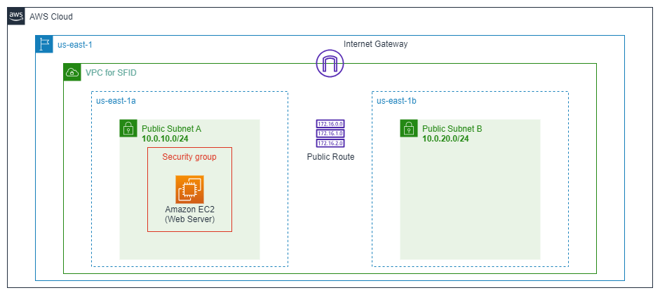

## Iniciar instância EC2
Vamos criar uma instância EC2 simples usando CloudFormation

1. Abra um editor de texto e crie um arquivo YAML vazio chamado:
```yaml
sfid-cfn-ec2.yaml
```

2. Copie e cole o modelo de exemplo do CloudFormation que define um EC2 e salve o arquivo.
```yaml
Resources:
# Create EC2 Linux
  WebServerInstance:
    Type: AWS::EC2::Instance
    Properties:
      ImageId: "ami-07caf09b362be10b8"
      InstanceType: t3a.micro
```

3. Abra o console do AWS CloudFormation 
4. Clique em **Criar pilha**.
5. Em Preparar modelo, escolha **Modelo pronto**.
6. Em Origem do modelo, escolha **Carregar um arquivo de modelo**.
7. Clique no botão **Escolher arquivo** e navegue até onde o sfid-cfn-ec2.yaml foi salvo.
8. Selecione o arquivo sfid-cfn-ec2.yaml e clique em **Abrir**.
9. Clique em **Avançar**.
10. Forneça um nome para a pilha e clique em **Avançar**.
- O nome da pilha identifica a pilha. Use um nome para ajudar a distinguir a finalidade desta pilha.
- Recomendamos o uso para o propósito do nosso laboratório: SFID-CFN-EC2
11. Você pode deixar Configurar opções de pilha como padrão e clicar em **Avançar**.
12. Na página Revisar SFID-CFN-EC2 , role para baixo até o final e escolha Enviar .
13. Você pode clicar no botão de atualização algumas vezes até ver o status **CREATE_COMPLETE**.
14. Abra o console do AWS EC2 para verificar o EC2 criado usando o AWS CloudFormation.
Agora criamos uma instância EC2 simples, porém ela não está rotulada e não passamos os dados do usuário.

## Marcar e passar dados do usuário para a instância EC2
Vamos marcar nosso recurso fornecendo um nome para nossa instância e passar os Dados do Usuário para nossa Instância EC2.

1. Adicione o seguinte ao final do arquivo YAML chamado sfid-cfn-ec2.yaml e salve o arquivo.
```yaml
      Tags:
          - Key: Name
            Value: Web Server for IMD
      UserData: 
        Fn::Base64:
          !Sub |
          #!/bin/sh
          yum -y install httpd
          chkconfig httpd on
          systemctl start httpd
          echo '<html><center><text="#252F3E" style="font-family: Amazon Ember"><h1>AWS CloudFormation is Fun !!!</h1>' > /var/www/html/index.html
          echo '<h3></h3></html>' >> /var/www/html/index.html
```

2. Abra o console do AWS CloudFormation Stacks 
3. Selecione o nome da pilha “SFID-CFN-EC2” na lista de pilhas
4. Clique no botão **Atualizar**.
5. Em Preparar modelo, escolha **Substituir modelo atual**.
6. Em Origem do modelo, escolha **Carregar um arquivo de modelo**.
7. Clique no botão **Escolher arquivo** e navegue até onde o sfid-cfn-ec2.yaml foi salvo
8. Selecione o arquivo sfid-cfn-ec2.yaml e clique em **Abrir**.
9. Clique em **Avançar**.
10. Você pode deixar os Parâmetros já que nada foi definido e clicar em **Avançar**.
11. Você pode deixar Configurar opções de pilha como padrão e clicar em **Avançar**.
12. Verifique a lista Alterações na visualização do conjunto de alterações; que mostra como as alterações podem afetar os recursos em execução; neste caso, elas não afetarão nosso modelo.
13. Clique em **Enviar**.
14. Você pode clicar no botão de atualização algumas vezes até ver o status **UPDATE_COMPLETE**.
Navegue até o console do AWS EC2 para verificar a etiqueta de nome EC2 e acessar outras características do site.

Prestando atenção às configurações da instância do EC2, você notará que a instância foi iniciada na VPC padrão, usando um grupo de segurança padrão que não permite tráfego para a Internet e o script de dados do usuário sendo executado somente durante a inicialização da instância. No nosso caso, esse não é o objetivo final do nosso laboratório.

Dito isso, encerraremos a instância do EC2 e iniciaremos uma nova instância do EC2 no VPC Lab com as configurações adequadas usando o AWS CloudFormation.

## Encerrar instância EC2
Vamos encerrar a instância do EC2 no console do CloudFormation

1. Abra o console do AWS CloudFormation Stacks 
2. Selecione o nome da pilha “SFID-CFN-EC2” na lista de pilhas
3. Clique no botão **Excluir**, que solicitará que você confirme se deseja excluir a pilha, incluindo seus recursos.
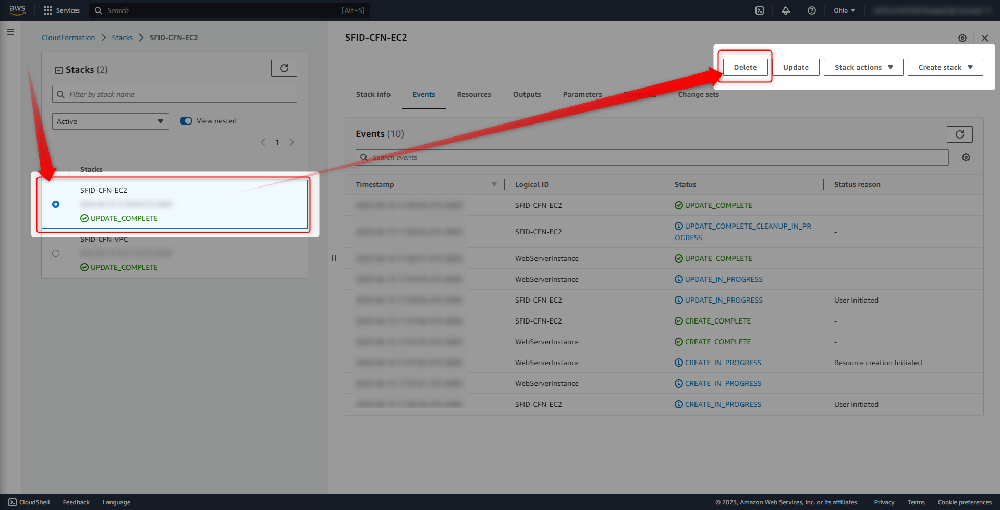

4. Clique em **Excluir pilha**
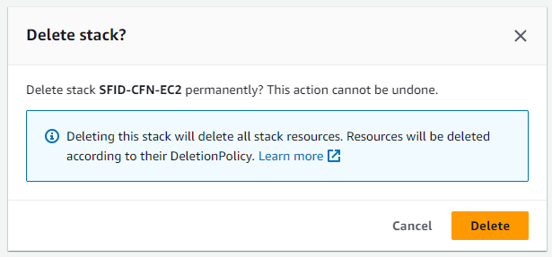

Observe que o nome da pilha "SFID-CFN-EC2" mudará de status para "Exclusão em andamento" por um momento até desaparecer. Você também pode verificar o Painel do EC2 e confirmar se a instância do EC2 foi excluída.

## Inicie a instância do EC2 no Lab VPC
Agora que temos um melhor entendimento sobre como o modelo AWS CloudFormation funciona e as configurações necessárias para que um host da web seja iniciado com as configurações adequadas, vamos criar uma instância EC2 na VPC adequada usando o CloudFormation

1. Adicione o seguinte ao topo do arquivo YAML chamado sfid-cfn-ec2.yaml 
```yaml
Parameters:
  PublicSubnet:
    Description: Select a Public Subnet created in the "VPC for SFID CFN" Lab (Hint - Search for "SFID")
    Type: 'AWS::EC2::Subnet::Id'
  SecurityGroup:
    Description: Select the Security Group created in the "VPC for SFID CFN" Lab (Hint - Search for "SFID")
    Type: 'AWS::EC2::SecurityGroup::Id'
```
2. Adicione o seguinte ao final do arquivo YAML chamado sfid-cfn-ec2.yaml e salve o arquivo.
```yaml
      NetworkInterfaces:
        - GroupSet:
            - !Ref SecurityGroup
          AssociatePublicIpAddress: 'true'
          DeviceIndex: '0'
          DeleteOnTermination: 'true'
          SubnetId: !Ref PublicSubnet
```

3. Abra o console do AWS CloudFormation 
4. Clique em **Criar pilha**.
5. Em Preparar modelo, escolha **Modelo pronto**.
6. Em Origem do modelo, escolha **Carregar um arquivo de modelo**.
7. Clique no botão **Escolher arquivo** e navegue até onde o sfid-cfn-ec2.yaml foi salvo.
8. Selecione o arquivo sfid-cfn-ec2.yaml e clique em **Abrir**.
9. Clique em **Avançar**.
10. Forneça um nome para a pilha, defina os parâmetros desejados e clique em **Avançar**.
- Recomendamos o uso para o propósito do nosso laboratório.SFID-CFN-EC2
- Selecione qualquer uma das **sub-redes públicas A ou B** criadas no laboratório "VPC para SFID CFN" **(Dica: Pesquise por "SFID")**
- Selecione **webserver-sg** criado no laboratório "VPC para SFID CFN" **(Dica: Procure por "SFID")**
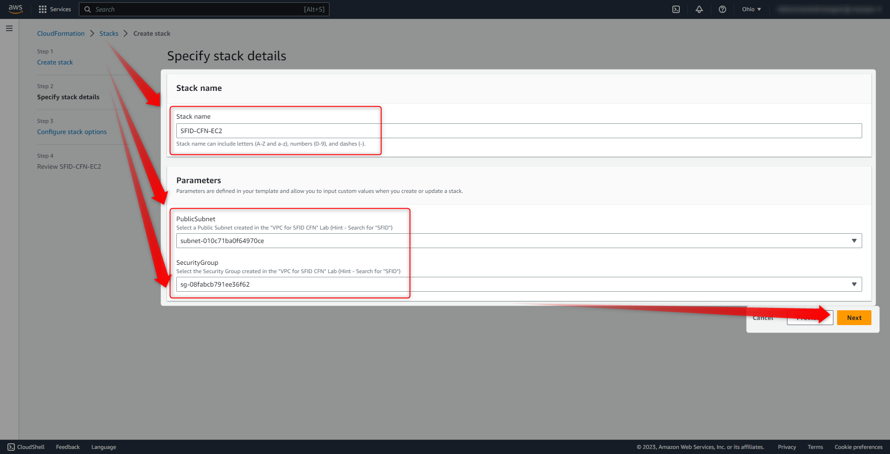

11. Você pode deixar Configurar opções de pilha como padrão e clicar em **Avançar**.
12. Na página Revisar SFID-CFN-EC2 , role para baixo até o final e escolha **Enviar**.
13. Você pode clicar no botão de atualização algumas vezes até ver o status **CREATE_COMPLETE**.
14. Abra o console do AWS EC2 para verificar o EC2 criado usando o AWS CloudFormation.
Verifique a aba “Segurança” e “Rede” no Console do AWS EC2 e você notará que a instância foi iniciada com base nas informações que selecionamos no prompt “Parâmetros”.
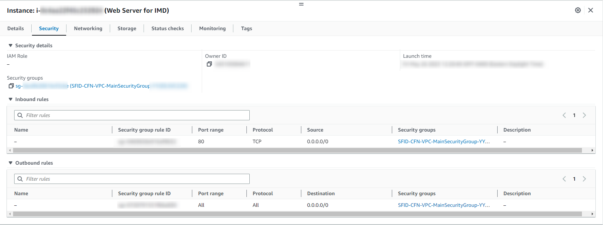

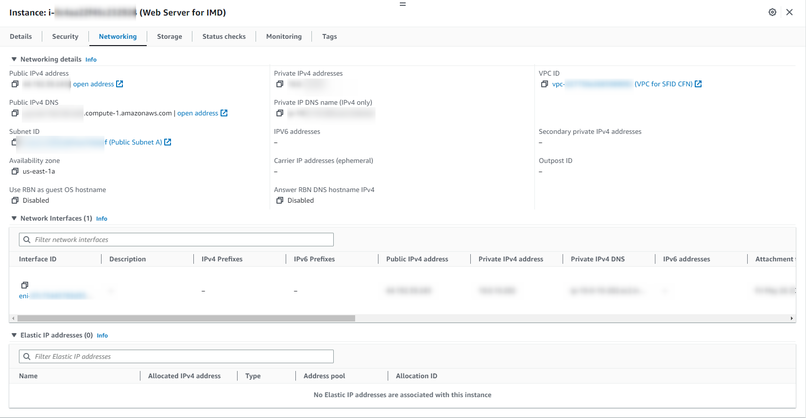

>**Site:**
>O site levará cerca de um minuto para ficar disponível.

Você também pode obter o endereço IP público atribuído à instância do Amazon EC2, que exibirá a página abaixo:
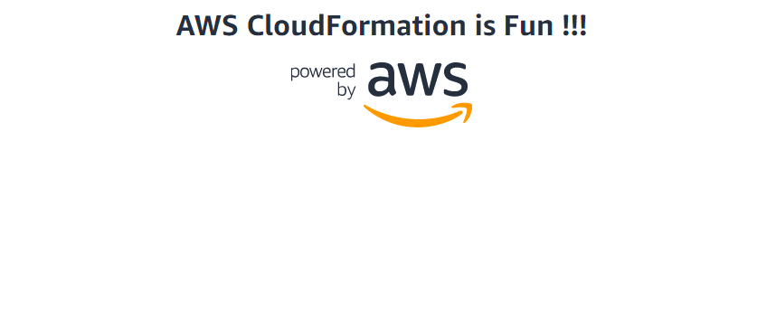
